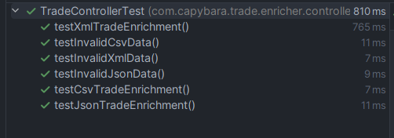

# Trade Enricher Service

A Spring WebFlux-based service that enriches trade data with product information stored in Redis.

## Prerequisites

- Java 17 or higher
- Maven 3.6+
- Redis server running on port 6379

## Running the Application

1. Start Redis server locally:
```bash
redis-server
```

2. Build the application:
```bash
mvn clean package
```

3. Run the application:
```bash
java -jar target/trade-enricher-0.0.1-SNAPSHOT.jar
```

The application will automatically load product data from the configured CSV file (default: largeSizeProduct.csv) into Redis on startup. To change it - modify the application.properties.

## API Documentation

### Process Trade Data

Endpoint: `POST /api/v1/trade`

Supports three content types:
- `application/json`
- `application/xml`
- `text/csv`

#### Example Requests

JSON:
```json
{
  "date": "20240120",
  "productId": "5",
  "currency": "USD",
  "price": 100.50
}
```

XML:
```xml
<trade>
    <date>20240120</date>
    <productId>5</productId>
    <currency>USD</currency>
    <price>100.50</price>
</trade>
```

CSV:
```csv
date,productId,currency,price
20240120,5,USD,100.50
```

## Configuration

Key configurations in `application.properties`:

```properties
spring.data.redis.port=6379 # Redis server port
product.loader.file=largeSizeProduct.csv # Product data file
spring.task.execution.pool.core-size=8 # Thread pool settings
spring.task.execution.pool.max-size=16 # Thread pool settings
spring.task.execution.pool.queue-capacity=10000 # Thread pool settings
```

## Completed Tasks

### 1. Multiple Input Formats Support
- ✅ Implemented support for CSV, JSON, and XML input formats
- ✅ Used Spring WebFlux for handling different content types
- ✅ Implemented proper serialization/deserialization for each format
- See example requests in the API Documentation section

### 2. Async Processing
- ✅ Implemented non-blocking async processing using Spring WebFlux
- ✅ Utilized Project Reactor for reactive programming
- ✅ Configured thread pool settings for optimal performance
- ✅ Implemented async Redis operations

### 3. Reactive Data Streaming
- ✅ Implemented reactive streaming using Project Reactor
- ✅ Used Flux for handling data streams
- ✅ Efficient memory usage for large datasets
- ✅ Reactive Redis operations integration

## Performance Test Results

### Integration Tests results

- ✅ Added integration tests for trade enrichment
- ✅ Verified JSON, XML, and CSV input handling
- ✅ Checked response content and structure
- ✅ Tested invalid data scenarios for JSON, XML, and CSV
- ✅ Ensured proper logging of responses
- ✅ Configured WebTestClient for testing with a response timeout
- ✅ Validated enriched trade data contains product information
- ✅ Confirmed correct handling of empty or invalid responses

## Future Improvements

1. **Performance Optimizations**
   - Implement batch processing for trade enrichment
   - Add Redis connection pooling
   - Fine-tune thread pool settings

2. **Resilience**
   - Add circuit breakers for Redis operations
   - Implement retry mechanisms
   - Add health check endpoints

3. **Monitoring & Observability**
   - Add Prometheus metrics
   - Implement distributed tracing
   - Enhanced logging and monitoring

4. **Security**
   - Add authentication and authorization
   - Input validation and sanitization
   - Rate limiting

5. **Testing**
   - Add more unit tests
   - Integration tests with TestContainers
   - Performance tests

6. **Documentation**
   - OpenAPI/Swagger documentation
   - More detailed API documentation
   - Architecture diagrams

7. **Features**
   - Support for more input/output formats
   - Bulk operation endpoints
   - Real-time trade processing via WebSocket
   - Product data management API
